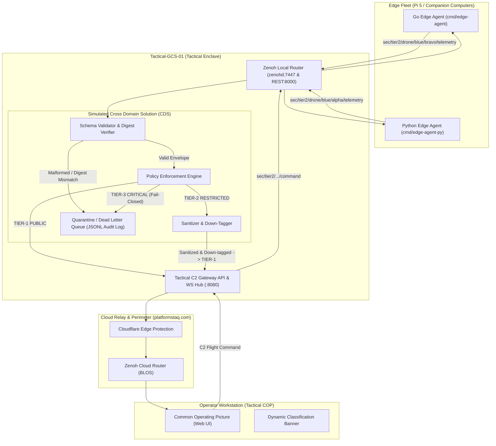

# Blue Polar Bear: Tactical Edge-to-Cloud C2 & Telemetry Mesh

[](https://opensource.org/licenses/Apache-2.0)
[](https://zenoh.io/)
[](https://go.dev/)

> **A distributed, zero-trust Command & Control (C2) and Telemetry system featuring a simulated Cross Domain Solution (CDS) Guard, multi-tier classification tagging, and edge-to-cloud mesh routing across physical ARM64 and x86 hardware.**

---

## ⚠️ Synthetic Security Advisory & OPSEC Notice

> [!IMPORTANT]
> **SIMULATION & RESEARCH NOTICE**: All classification banners, security tags, and enclave identifiers used in this repository (`TIER-1: PUBLIC`, `TIER-2: RESTRICTED`, `TIER-3: CRITICAL`) are **strictly synthetic designations** created for demonstrating Cross Domain Solution (CDS) schema validation and data sanitization algorithms. No classified, controlled unclassified (CUI), or sensitive government information is contained in or processed by this codebase.

### Synthetic Classification Equivalency Table

| Synthetic Tier | Operational Definition | Simulation Analog | Data Policy & CDS Enforcement |
| :--- | :--- | :--- | :--- |
| **`TIER-1: PUBLIC`** | Open / Unrestricted | Simulated Unclassified | Unrestricted broadcast; basic telemetry and vehicle heartbeat. |
| **`TIER-2: RESTRICTED`** | Controlled / Mission Data | Simulated Secret | High-precision GPS, payload telemetry. Sanitized/redacted before exiting tactical boundary. |
| **`TIER-3: CRITICAL`** | Sovereign / High-Value | Simulated Top Secret | Electronic warfare / sovereign mission state. **Fail-Closed:** Strictly barred from exiting the tactical edge. |

---

## 1. Project Overview

Modern defense, aerospace, and autonomous robotics operations operate in **DDIL** environments (**D**isconnected, **D**egraded, **I**ntermittent, **L**atent). Traditional monolithic cloud-only architectures fail when satellite links drop or edge nodes enter radio silence.

**Blue Polar Bear** solves this by establishing a decentralized, multi-tiered mesh using **Eclipse Zenoh**:
1. **Edge Companion Computing:** High-rate flight telemetry and local command handling on embedded hardware.
2. **Tactical Field GCS & CDS Guard:** A local Ground Control Station that inspects every packet, rejects malformed/tampered payloads into a quarantine audit log, and sanitizes restricted data.
3. **Beyond-Line-of-Sight (BLOS) Cloud Relay:** Zero-trust relay via Cloudflare (`platformstaq.com`) and cloud edge routing into a browser-based Common Operating Picture (COP).

---

## 2. Hardware Fleet Deployment

This system is designed and tested across **physical distributed hardware**, not simulated `localhost`:

```
┌───────────────────────────────────────┐
│     EDGE HARDWARE (Edge-Node-01)      │
│  Device: Raspberry Pi 5 (ARM64)       │
│  Role: Vehicle Companion Computer     │
│  Stack: Go / Python (Zenoh Edge Pub)  │
└──────────────────┬────────────────────┘
                   │ Local Tactical Mesh (Wi-Fi / LAN)
                   ▼
┌────────────────────────────────────────────────────────┐
│     TACTICAL GROUND CONTROL (Tactical-GCS-01)          │
│  Device: Surface Pro 3 (Ubuntu x86_64)                 │
│  Role: Field Gateway & Local C2 Controller             │
│  Stack: Go CDS Guard + Zenoh Router (zenohd)           │
└──────────────────┬─────────────────────────────────────┘
                   │ Encrypted Egress (Cloudflare Tunnel / TLS)
                   ▼
┌────────────────────────────────────────────────────────┐
│     CLOUD RELAY & DMZ (Cloud-Relay-01)                 │
│  Endpoint: relay.platformstaq.com                      │
│  Role: Public Gateway / BLOS Switchboard               │
│  Stack: Zenoh Cloud Router + Inspection Proxy          │
└──────────────────┬─────────────────────────────────────┘
                   │ WebSockets / WSS
                   ▼
┌───────────────────────────────────────┐
│     TACTICAL COP (Operator-Station)   │
│  Endpoint: c2.platformstaq.com        │
│  Role: Global Command & Control Web UI│
│  Stack: HTML5 / Leaflet Map / Canvas  │
└──────────────────┬────────────────────┘
```

---

## 3. System Architecture & Cross Domain Solution (CDS)



---

## 4. Key Engineering Capabilities

1. **Zero-Trust Cross Domain Solution (CDS):**
   - Cryptographic SHA-256 integrity verification on all security envelopes.
   - Fail-closed security architecture: malformed or policy-violating packets are quarantined to an immutable JSONL audit log.
   - Automated High-to-Low redaction (coarsening GPS coordinates to 2 decimals / ~1.1 km and stripping mission payload state).
2. **Deterministic Multi-Language Systems:**
   - Low-latency, high-concurrency ingestion and guard daemons written in **Go 1.22+**.
   - Edge agent companion simulators in **Go** and **Python 3.10+**.
3. **Resilient Dual-Mode Operation:**
   - **Tactical Mode:** 100% operational offline in disconnected/isolated field conditions.
   - **Enterprise Mode:** Automatic replication to global cloud COP via Cloudflare Zero-Trust tunnels whenever upstream backhaul is restored.

---

## 5. Repository Structure

```text
edgeCompute/
├── cmd/
│   ├── edge-agent/        # Telemetry generator simulating physical vehicle (Go)
│   ├── edge-agent-py/     # Alternative Python edge agent (Pi 5 companion)
│   ├── cds-guard/         # Cross Domain Solution guard & redaction daemon (Go)
│   └── c2-gateway/        # WebSocket/HTTP server streaming telemetry to web (Go)
├── pkg/
│   ├── schema/            # Canonical data structs (SecurityEnvelope, TelemetryPayload)
│   ├── policy/            # CDS redaction rules, synthetic tiers, and DLQ audit log
│   └── zenohutil/         # Reusable Zenoh session, topic key standards, and REST client
├── web/                   # Web-based Tactical C2 Dashboard (HTML5 / Canvas / Leaflet)
├── configs/
│   ├── zenoh-edge.json5   # Pi 5 Zenoh configuration
│   ├── zenoh-gcs.json5    # GCS Zenoh router configuration (REST plugin: 8000)
│   └── zenoh-cloud.json5  # Cloud router configuration
├── compose.yml            # Docker Compose orchestration for tactical mesh
├── go.mod                 # Go module definitions
├── README.md              # Project architecture and security specifications
└── AGENTS.md              # Multi-agent operating procedures & development rules
```

---

## 6. Quickstart & Execution Guide

### Option A: Local Multi-Container Stack (Docker Compose)
Launch the Zenoh router, CDS Guard, C2 Gateway, and Edge vehicle simulator:
```bash
docker compose up --build
```
- **Tactical COP Dashboard:** Open [http://localhost:8080](http://localhost:8080)
- **CDS Guard Inspection API:** [http://localhost:8081/health](http://localhost:8081/health) and [http://localhost:8081/dlq](http://localhost:8081/dlq)
- **Zenoh REST Interface:** [http://localhost:8000](http://localhost:8000)

---

### Option B: Native Host Execution (Standalone Mock Bus)
Each component includes an in-memory mock bus for standalone testing without a running Zenoh router daemon:

1. **Start the Cross Domain Solution Guard:**
   ```bash
   go run cmd/cds-guard/main.go -mock -http-port 8081
   ```

2. **Start the Tactical C2 Gateway & Web COP:**
   ```bash
   go run cmd/c2-gateway/main.go -mock -port 8080
   ```
   Access the dashboard at `http://127.0.0.1:8080`.

3. **Start the Vehicle Edge Agent:**
   - **Go Simulator:**
     ```bash
     go run cmd/edge-agent/main.go -id bravo -rate 1.0 -mock
     ```
   - **Python Pi 5 Companion:**
     ```bash
     .venv/bin/python3 cmd/edge-agent-py/main.py --id alpha --rate 1.0
     ```

---

## 7. Verification & Automated Testing Playbook

Run the complete test suite across all subsystems:

```bash
# 1. Run all Go unit and integration tests
go test -v ./...

# 2. Run Python syntax verification and unit tests
python3 -m py_compile cmd/edge-agent-py/*.py
.venv/bin/python3 cmd/edge-agent-py/test_agent.py

# 3. Verify binary compilation
go build -o /dev/null ./cmd/cds-guard
go build -o /dev/null ./cmd/c2-gateway
go build -o /dev/null ./cmd/edge-agent
```

---

## 8. License

Licensed under the Apache License, Version 2.0.
