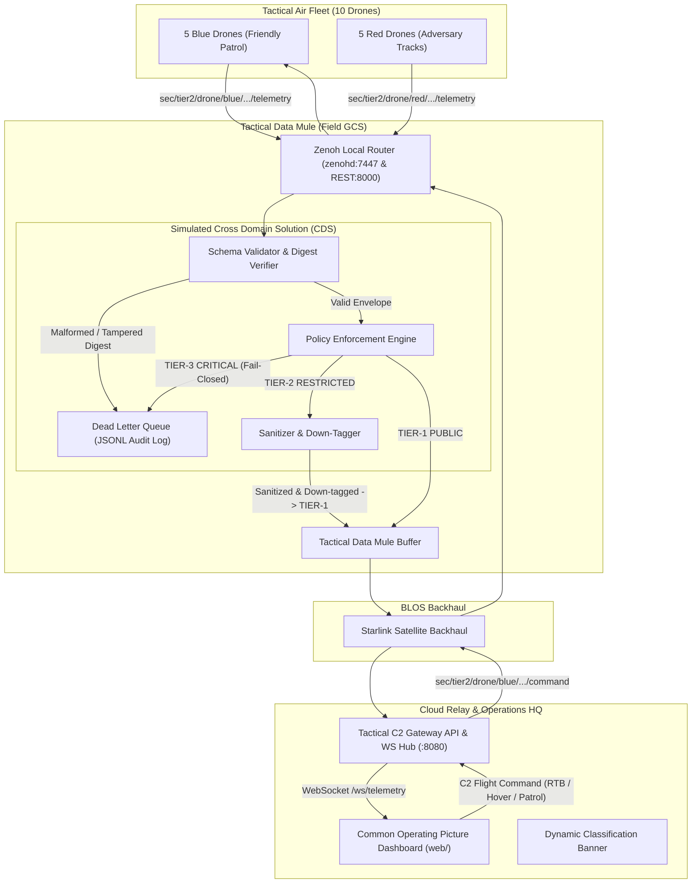

# Blue Polar Bear: Tactical Edge-to-Cloud C2 & Telemetry Mesh

[](https://opensource.org/licenses/Apache-2.0)
[](https://zenoh.io/)
[](https://go.dev/)

> **A distributed, zero-trust Tactical Command & Control (C2) and Telemetry system featuring a 10-drone swarm simulator, Cross Domain Solution (CDS) Guard, Data Mule buffering, Starlink satellite backhaul, and a browser-based Common Operating Picture (COP).**

---

## ⚠️ Synthetic Security Advisory & OPSEC Notice

> [!IMPORTANT]
> **SIMULATION & RESEARCH NOTICE**: All classification banners, security tags, and enclave identifiers used in this repository (`TIER-1: PUBLIC`, `TIER-2: RESTRICTED`, `TIER-3: CRITICAL`) are **strictly synthetic designations** created for demonstrating Cross Domain Solution (CDS) schema validation and data sanitization algorithms. No classified, controlled unclassified (CUI), or sensitive government information is contained in or processed by this codebase.

### Synthetic Classification Equivalency Table

| Synthetic Tier | Operational Definition | Simulation Analog | Data Policy & CDS Enforcement |
| :--- | :--- | :--- | :--- |
| **`TIER-1: PUBLIC`** | Open / Unrestricted | Simulated Unclassified | Unrestricted broadcast; basic telemetry and vehicle heartbeat. |
| **`TIER-2: RESTRICTED`** | Controlled / Mission Data | Simulated Secret | High-precision GPS, payload telemetry. Sanitized/redacted before exiting tactical boundary. |
| **`TIER-3: CRITICAL`** | Sovereign / High-Value | Simulated Top Secret | Electronic warfare / sovereign mission state. **Fail-Closed:** Strictly barred from exiting the tactical edge. |

---

## 1. Project Overview & Hybrid Architecture

Modern defense, aerospace, and autonomous robotics operations operate in **DDIL** environments (**D**isconnected, **D**egraded, **I**ntermittent, **L**atent). Traditional monolithic cloud-only architectures fail when satellite links drop or edge nodes enter radio silence.

**Blue Polar Bear** solves this with a **Hybrid Mesh & API Architecture**:

1. **Autonomous Edge Mesh (Local RF):** Drones communicate with low-latency pub/sub over **Eclipse Zenoh** on the local tactical boundary without requiring an Internet connection.
2. **Tactical Data Mule (Field GCS):** The field Ground Control Station (e.g. Surface Pro / ruggedized laptop) acts as a **Data Mule**, storing, buffering, and fail-closed inspecting packets via the **Cross Domain Solution (CDS) Guard**.
3. **Starlink Satellite Backhaul:** When satellite connectivity is available, Zenoh automatically synchronizes and replicates sanitized data across the **Starlink** link to the cloud relay (`relay.platformstaq.com`).
4. **C2 API Gateway & Web COP:** The C2 Gateway translates Zenoh mesh topics into standard **WebSockets (`/ws/telemetry`)** and **REST APIs (`/api/v1/fleet`, `/api/v1/command`)**, allowing browser dashboards, ATAK, and enterprise consumers to ingest telemetry with zero proprietary client libraries.

---

## 2. Hardware Fleet & Data Mule Deployment

This system is tested across physical distributed hardware:

```
┌────────────────────────────────────────────────────────┐
│             TACTICAL AIR FLEET (10 Drones)             │
│   5 Blue Team Drones (Friendly C2 Controlled)          │
│   5 Red Team Drones (Autonomous Adversary Tracks)      │
│   Stack: Go Edge Agent (Zenoh Pub/Sub)                 │
└───────────────────────────┬────────────────────────────┘
                            │ Local Tactical Mesh (Wi-Fi / Tactical RF)
                            ▼
┌────────────────────────────────────────────────────────┐
│     TACTICAL GROUND CONTROL & DATA MULE (Field GCS)    │
│  Device: Surface Pro 3 (Ubuntu x86_64)                 │
│  Role: Tactical Data Mule & Zero-Trust CDS Guard       │
│  Stack: Go CDS Guard + Zenoh Router (zenohd)           │
│  Function: Buffers & sanitizes data during comms blackouts
└───────────────────────────┬────────────────────────────┘
                            │ Starlink Satellite Backhaul / Cloudflare Tunnel
                            ▼
┌────────────────────────────────────────────────────────┐
│           CLOUD RELAY & BLOS SWITCHBOARD               │
│  Endpoint: relay.platformstaq.com                      │
│  Role: Public Gateway / Enterprise Replication         │
│  Stack: Zenoh Cloud Router + C2 API Gateway            │
└───────────────────────────┬────────────────────────────┘
                            │ WebSockets / WSS (:8080)
                            ▼
┌────────────────────────────────────────────────────────┐
│            TACTICAL COP (Operator Workstation)         │
│  Endpoint: c2.platformstaq.com                         │
│  Role: Global Command & Control Web UI                 │
│  Stack: HTML5 / Canvas Radar / Leaflet Map             │
└────────────────────────────────────────────────────────┘
```

---

## 3. End-to-End System Architecture & Data Flow



---

## 4. Swarm Operational Behavior (10 Drones)

The system simulates a live tactical scenario:
* **Blue Fleet (5 Friendly Drones):**
  - Callsigns: `blue-alpha`, `blue-bravo`, `blue-charlie`, `blue-delta`, `blue-echo`
  - Clustered in the friendly western operating sector.
  - Interactive C2 Dispatch: Operators can command any Blue drone to **Return to Base (RTB)**, **Hover / Loiter**, **Patrol**, or **Arm / Disarm**.
* **Red Fleet (5 Adversary Drones):**
  - Callsigns: `red-1`, `red-2`, `red-3`, `red-4`, `red-5`
  - Clustered in the adversary eastern operating sector.
  - Follow autonomous patrol trajectories and emit adversary mission sensor payloads.

---

## 5. Repository Structure

```text
edgeCompute/
├── .agents/skills/        # Specialized Antigravity agent runbooks
│   ├── cds-policy-enforcer/
│   ├── edge-agent-companion/
│   ├── tactical-c2-dispatch/
│   ├── zenoh-mesh-ops/
│   └── zero-trust-testing/
├── cmd/
│   ├── edge-agent/        # 10-drone swarm simulator (5 Blue, 5 Red) (Go)
│   ├── cds-guard/         # Cross Domain Solution guard & redaction daemon (Go)
│   └── c2-gateway/        # WebSocket/HTTP server streaming telemetry to web (Go)
├── pkg/
│   ├── schema/            # Canonical data structs (SecurityEnvelope, TelemetryPayload)
│   ├── policy/            # CDS redaction rules, synthetic tiers, and DLQ audit log
│   └── zenohutil/         # Reusable Zenoh session, topic key standards, and REST client
├── web/                   # Web-based Tactical C2 Dashboard (HTML5 / Canvas / Leaflet)
├── configs/
│   ├── zenoh-edge.json5   # Edge client configuration
│   ├── zenoh-gcs.json5    # GCS Zenoh router configuration (REST plugin: 8000)
│   └── zenoh-cloud.json5  # Cloud router configuration
├── deploy/                # Container build specifications
│   ├── Dockerfile.cds-guard
│   ├── Dockerfile.c2-gateway
│   └── Dockerfile.edge-agent
├── compose.yml            # Docker Compose orchestration for tactical mesh
├── go.mod                 # Go module definitions
├── README.md              # Project architecture and security specifications
└── AGENTS.md              # Multi-agent operating procedures & development rules
```

---

## 6. Quickstart & Execution Guide

### Option A: Local Multi-Container Stack (Docker Compose)
Launch the Zenoh router, CDS Guard, C2 Gateway, and 10-drone swarm:
```bash
docker compose up --build
```
- **Tactical COP Dashboard:** Open [http://localhost:8080](http://localhost:8080)
- **CDS Guard Inspection API:** [http://localhost:8081/health](http://localhost:8081/health) and [http://localhost:8081/dlq](http://localhost:8081/dlq)
- **Zenoh REST Interface:** [http://localhost:8000](http://localhost:8000)

---

### Option B: Native Host Execution (Standalone Mock Bus)
Each component includes an in-memory mock bus for testing without running a Zenoh daemon:

1. **Start the Cross Domain Solution Guard:**
   ```bash
   go run cmd/cds-guard/main.go -mock -http-port 8081
   ```

2. **Start the Tactical C2 Gateway & Web COP:**
   ```bash
   go run cmd/c2-gateway/main.go -mock -port 8080
   ```
   Access the dashboard at `http://127.0.0.1:8080`.

3. **Start the 10-Drone Swarm Simulator (5 Blue, 5 Red):**
   ```bash
   go run cmd/edge-agent/main.go -swarm -blue-count 5 -red-count 5 -mock
   ```

---

## 7. Verification & Automated Testing Playbook

Run the complete test suite across all subsystems:

```bash
# 1. Run all Go unit and integration tests
go test -v ./...

# 2. Verify all Go production binaries compile
go build -o /dev/null ./cmd/cds-guard
go build -o /dev/null ./cmd/c2-gateway
go build -o /dev/null ./cmd/edge-agent

# 3. Test multi-container stack integration
docker compose up -d --build
docker compose ps
docker compose down
```

---

## 8. License

Licensed under the Apache License, Version 2.0.
