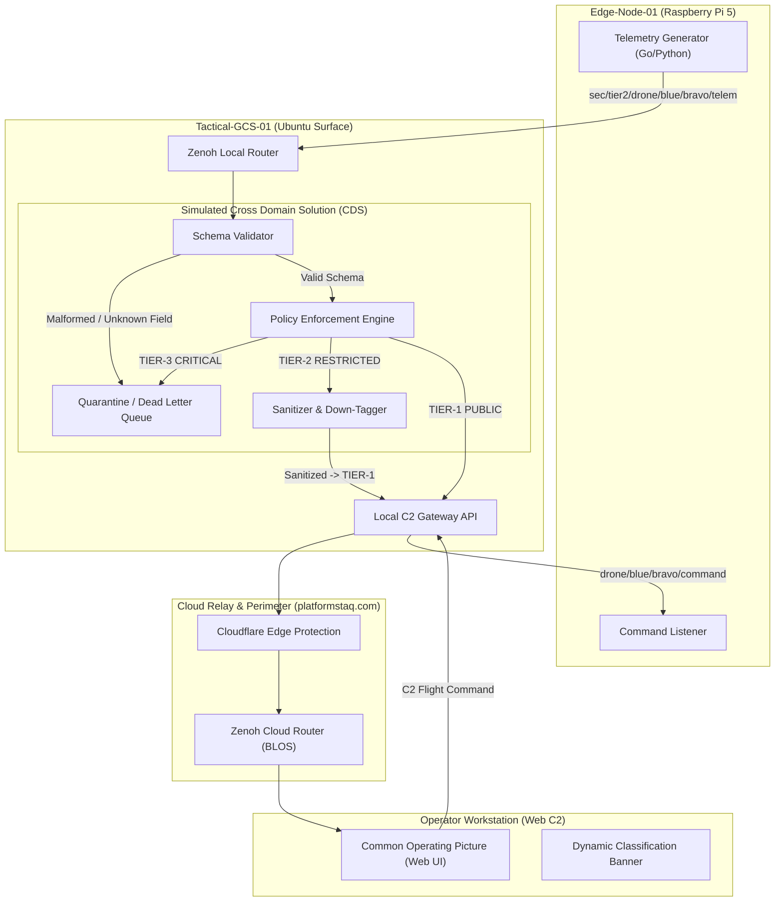

# Blue Polar Bear: Tactical Edge-to-Cloud C2 & Telemetry Mesh

[](https://opensource.org/licenses/Apache-2.0)
[](https://zenoh.io/)
[](https://go.dev/)

> **A distributed, zero-trust Command & Control (C2) and Telemetry system featuring a simulated Cross Domain Solution (CDS) Guard, multi-tier classification tagging, and edge-to-cloud mesh routing across physical ARM64 and x86 hardware.**

---

## ⚠️ Synthetic Security Advisory & OPSEC Notice

> [!IMPORTANT]
> **SIMULATION & RESEARCH NOTICE**: All classification banners, security tags, and enclave identifiers used in this repository (`TIER-1: PUBLIC`, `TIER-2: RESTRICTED`, `TIER-3: CRITICAL`) are **strictly synthetic designations** created for demonstrating Cross Domain Solution (CDS) schema validation and data sanitization algorithms. No classified, controlled unclassified (CUI), or sensitive government information is contained in or processed by this codebase.

### Synthetic Classification Equivalency Table

| Synthetic Tier | Operational Definition | Simulation Analog | Data Policy & CDS Enforcement |
| :--- | :--- | :--- | :--- |
| **`TIER-1: PUBLIC`** | Open / Unrestricted | Simulated Unclassified | Unrestricted broadcast; basic telemetry and vehicle heartbeat. |
| **`TIER-2: RESTRICTED`** | Controlled / Mission Data | Simulated Secret | High-precision GPS, payload telemetry. Sanitized/redacted before exiting tactical boundary. |
| **`TIER-3: CRITICAL`** | Sovereign / High-Value | Simulated Top Secret | Electronic warfare / sovereign mission state. **Fail-Closed:** Strictly barred from exiting the tactical edge. |

---

## 1. Project Overview

Modern defense, aerospace, and autonomous robotics operations operate in **DDIL** environments (**D**isconnected, **D**egraded, **I**ntermittent, **L**atent). Traditional monolithic cloud-only architectures fail when satellite links drop or edge nodes enter radio silence.

**Blue Polar Bear** solves this by establishing a decentralized, multi-tiered mesh using **Eclipse Zenoh**:
1. **Edge Companion Computing:** High-rate flight telemetry and local command handling on embedded hardware.
2. **Tactical Field GCS & CDS Guard:** A local Ground Control Station that inspects every packet, rejects malformed/tampered payloads into a quarantine audit log, and sanitizes restricted data.
3. **Beyond-Line-of-Sight (BLOS) Cloud Relay:** Zero-trust relay via Cloudflare (`platformstaq.com`) and cloud edge routing into a browser-based Common Operating Picture (COP).

---

## 2. Hardware Fleet Deployment

This system is designed and tested across **physical distributed hardware**, not simulated `localhost`:

```
┌───────────────────────────────────────┐
│     EDGE HARDWARE (Edge-Node-01)      │
│  Device: Raspberry Pi 5 (ARM64)       │
│  Role: Vehicle Companion Computer     │
│  Stack: Go / Python (Zenoh Edge Pub)  │
└──────────────────┬────────────────────┘
                   │ Local Tactical Mesh (Wi-Fi / LAN)
                   ▼
┌────────────────────────────────────────────────────────┐
│     TACTICAL GROUND CONTROL (Tactical-GCS-01)          │
│  Device: Surface Pro 3 (Ubuntu x86_64)                 │
│  Role: Field Gateway & Local C2 Controller             │
│  Stack: Go CDS Guard + Zenoh Router (zenohd)           │
└──────────────────┬─────────────────────────────────────┘
                   │ Encrypted Egress (Cloudflare Tunnel / TLS)
                   ▼
┌────────────────────────────────────────────────────────┐
│     CLOUD RELAY & DMZ (Cloud-Relay-01)                 │
│  Endpoint: relay.platformstaq.com                      │
│  Role: Public Gateway / BLOS Switchboard               │
│  Stack: Zenoh Cloud Router + Inspection Proxy          │
└──────────────────┬─────────────────────────────────────┘
                   │ WebSockets / WSS
                   ▼
┌───────────────────────────────────────┐
│     TACTICAL COP (Operator-Station)   │
│  Endpoint: c2.platformstaq.com        │
│  Role: Global Command & Control Web UI│
│  Stack: React / HTML5 / Leaflet Map   │
└───────────────────────────────────────┘
```

---

## 3. System Architecture & Cross Domain Solution (CDS)



---

## 4. Key Engineering Capabilities

1. **Zero-Trust Cross Domain Solution (CDS):**
   - Strict JSON/Protobuf schema enforcement on all ingress packets.
   - Fail-closed security architecture: malformed packets are quarantined with tamper-evident audit logs.
   - Automated High-to-Low redaction (coarsening GPS coordinates and stripping payload state).
2. **Deterministic Multi-Language Systems:**
   - Low-latency, high-concurrency ingestion and guard daemons written in **Go**.
   - Edge agent simulators in **Go** and **Python**.
3. **Resilient Dual-Mode Operation:**
   - **Tactical Mode:** 100% operational offline in disconnected/isolated field conditions.
   - **Enterprise Mode:** Automatic replication to global cloud COP via Cloudflare Zero-Trust tunnels whenever upstream backhaul is restored.

---

## 5. Repository Structure

```text
.
├── README.md               # Project architecture and security specifications
├── AGENTS.md               # Multi-agent operating procedures & development rules
├── archive/                # Early prototypes and scratch explorations
├── cmd/
│   ├── edge-agent/         # Edge telemetry publisher (Go/Python)
│   ├── cds-guard/          # Cross Domain Solution guard daemon (Go)
│   └── c2-gateway/         # Telemetry aggregation & WebSocket server (Go)
├── configs/
│   ├── zenoh-edge.json5    # Pi 5 Zenoh configuration
│   └── zenoh-gcs.json5     # GCS Zenoh router configuration
├── pkg/
│   ├── schema/             # Telemetry & Security Header data models
│   └── policy/             # CDS classification and redaction rules
└── web/                    # C2 Tactical Dashboard (HTML5 / WebSockets)
```

---

## 6. License
Licensed under the Apache License, Version 2.0.
