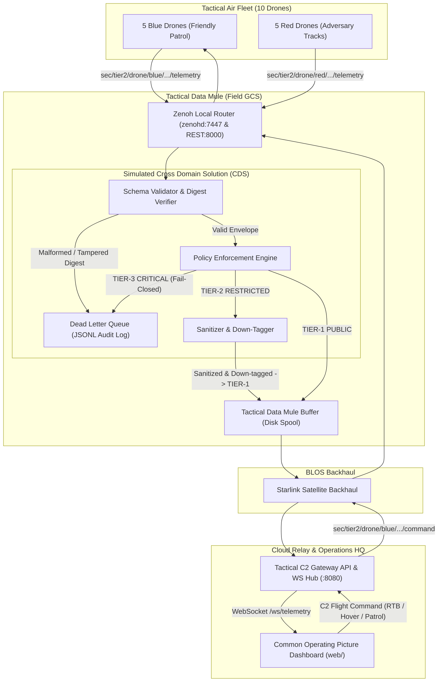

# Blue Polar Bear: System Architecture & Data Flows

This document details the distributed, zero-trust system architecture, communication flows, Cross Domain Solution (CDS) policies, and Disconnected, Degraded, Intermittent, Latent (DDIL) mechanics of **Blue Polar Bear**.

---

## 1. Synthetic Security Advisory & OPSEC Standards

> [!IMPORTANT]
> **SIMULATION & RESEARCH NOTICE**: All classification banners, security tags, and enclave identifiers used in this repository (`TIER-1: PUBLIC`, `TIER-2: RESTRICTED`, `TIER-3: CRITICAL`) are **strictly synthetic designations** created for demonstrating Cross Domain Solution (CDS) schema validation and data sanitization algorithms. No classified, controlled unclassified (CUI), or sensitive government information is contained in or processed by this codebase.

### Synthetic Classification Equivalency Table

| Synthetic Tier | Operational Definition | Simulation Analog | Data Policy & CDS Enforcement |
| :--- | :--- | :--- | :--- |
| **`TIER-1: PUBLIC`** | Open / Unrestricted | Simulated Unclassified | Unrestricted broadcast; basic telemetry and vehicle heartbeat. |
| **`TIER-2: RESTRICTED`** | Controlled / Mission Data | Simulated Secret | High-precision GPS, payload telemetry. Sanitized/redacted (coarsened ~1.1km) before exiting tactical boundary. |
| **`TIER-3: CRITICAL`** | Sovereign / High-Value | Simulated Top Secret | Electronic warfare / sovereign mission state. **Fail-Closed:** Strictly barred from exiting the tactical edge. |

---

## 2. Hybrid Mesh & API Architecture

Modern defense, aerospace, and autonomous robotics operations operate in **DDIL** environments. Traditional monolithic cloud-only architectures fail when satellite links drop or edge nodes enter radio silence.

**Blue Polar Bear** solves this with a **Hybrid Mesh & API Architecture**:

1. **Autonomous Edge Mesh (Local RF):** Drones communicate with low-latency pub/sub over **Eclipse Zenoh** on the local tactical boundary without requiring an Internet connection.
2. **Tactical Data Mule (Field GCS):** The field Ground Control Station (e.g., ruggedized laptop / Surface Pro) acts as a **Data Mule**, storing, buffering, and fail-closed inspecting packets via the **Cross Domain Solution (CDS) Guard**.
3. **Starlink Satellite Backhaul:** When satellite connectivity is available, Zenoh synchronizes and replicates sanitized data across the **Starlink** link to the cloud router (`relay.platformstaq.com`).
4. **C2 API Gateway & Web COP:** The C2 Gateway translates Zenoh mesh topics into standard **WebSockets (`/ws/telemetry`)** and **REST APIs (`/api/v1/fleet`, `/api/v1/command`, `/api/v1/backhaul`)**, allowing browser dashboards, ATAK, and enterprise consumers to ingest telemetry with zero proprietary client libraries.

---

## 3. Physical Hardware & Node Topology

```text
┌────────────────────────────────────────────────────────┐
│             TACTICAL AIR FLEET (10 Drones)             │
│   5 Blue Team Drones (Friendly C2 Controlled)          │
│   5 Red Team Drones (Autonomous Adversary Tracks)      │
│   Stack: Go Edge Agent (Zenoh Pub/Sub)                 │
└───────────────────────────┬────────────────────────────┘
                            │ Local Tactical Mesh (Wi-Fi / Tactical RF)
                            ▼
┌────────────────────────────────────────────────────────┐
│     TACTICAL GROUND CONTROL & DATA MULE (Field GCS)    │
│  Device: Surface Pro 3 (Ubuntu x86_64)                 │
│  Role: Tactical Data Mule & Zero-Trust CDS Guard       │
│  Stack: Go CDS Guard + Zenoh Router (zenohd)           │
│  Function: Buffers & sanitizes data during comms blackouts
└───────────────────────────┬────────────────────────────┘
                            │ Starlink Satellite Backhaul / Cloudflare Tunnel
                            ▼
┌────────────────────────────────────────────────────────┐
│           CLOUD RELAY & BLOS SWITCHBOARD               │
│  Endpoint: relay.platformstaq.com                      │
│  Role: Public Gateway / Enterprise Replication         │
│  Stack: Zenoh Cloud Router + C2 API Gateway            │
└───────────────────────────┬────────────────────────────┘
                            │ WebSockets / WSS (:8080)
                            ▼
┌────────────────────────────────────────────────────────┐
│            TACTICAL COP (Operator Workstation)         │
│  Endpoint: c2.platformstaq.com                         │
│  Role: Global Command & Control Web UI                 │
│  Stack: HTML5 / Canvas Radar / Leaflet Map             │
└────────────────────────────────────────────────────────┘
```

---

## 4. End-to-End System Architecture & Data Flow



---

## 5. Starlink Backhaul & Data Mule DDIL Mechanics

The Tactical Data Mule ([`pkg/zenohutil/mule.go`](file:///Users/mcamacho/git-repos/edgeCompute/pkg/zenohutil/mule.go)) ensures zero telemetry loss during prolonged satellite blackouts:

- **Automatic Spooling:** When the backhaul link drops (DDIL blackout), packets are written to a persistent JSON Lines disk spool (`logs/data-mule-spool.jsonl`).
- **Resilient Replay:** When Starlink reconnects, the Data Mule drains the spool in chronological order, verifies delivery, and flushes the backlog upstream to `relay.platformstaq.com`.

### Backhaul Inspection & Simulation Endpoints

| Method | Endpoint | Description | Sample Response / Payload |
| :--- | :--- | :--- | :--- |
| `GET` | `/api/v1/backhaul` | Query Data Mule sync metrics and spool queue depth | `{"backhaul_status":"ONLINE","pending_queue":0,"total_spooled":0,"total_synced":42,"spool_path":"logs/data-mule-spool.jsonl"}` |
| `POST` | `/api/v1/backhaul/simulate` | Toggle satellite connection blackout on/off | `{"ddil_active": true}` (simulates connection cut) or `{"ddil_active": false}` (reconnects & flushes) |

---

## 6. Swarm Operational Specifications (10 Drones)

The system simulates a live tactical scenario centered in Morocco (`31.6500° N, -8.0100° W`):
* **Blue Fleet (5 Friendly Drones):**
  - Callsigns: `blue-alpha`, `blue-bravo`, `blue-charlie`, `blue-delta`, `blue-echo`
  - Clustered in the friendly western operating sector.
  - Interactive C2 Dispatch: Operators can command any Blue drone to **Return to Base (RTB)**, **Hover / Loiter**, **Patrol**, **Arm / Disarm**, or **Toggle EW**.
* **Red Fleet (5 Adversary Drones):**
  - Callsigns: `red-1`, `red-2`, `red-3`, `red-4`, `red-5`
  - Clustered in the adversary eastern operating sector.
  - Follow autonomous patrol trajectories and emit adversary mission sensor payloads.

---

## 7. Fleet Scalability & Multi-Arch Flashing Architecture

Blue Polar Bear is engineered to scale from a single 10-drone tactical element to hundreds of airframes with zero architectural rework:

* **Pure Go Binaries (`CGO_ENABLED=0`):** Edge binaries have zero runtime C/C++ or dynamic library dependencies. They compile to self-contained, statically linked executables under 15MB.
* **Multi-Arch Matrix Pipeline:** Automated CI builds flashable binary packages for `linux/arm64` (Raspberry Pi 5, NVIDIA Jetson Orin, Voxl 2) and `linux/amd64` (x86_64 mission computers and GCS workstations) accompanied by SHA-256 cryptographic verification manifests.
* **Decentralized O(1) Overhead:** Inter-node pub/sub routing relies on peer-to-peer Eclipse Zenoh mesh protocols. Nodes do not maintain global state or register with centralized databases; adding 100 or 500 airframes simply extends the decentralized key expression tree (`sec/<tier>/<vehicle_type>/<team>/<unit_id>/...`).
* **Stateless Parameterization:** All drone parameters (callsign, team, recovery pads, MAVLink UDP ports) are injected dynamically via CLI flags or environment variables, allowing identical binaries to be flashed across entire fleets without recompilation.
